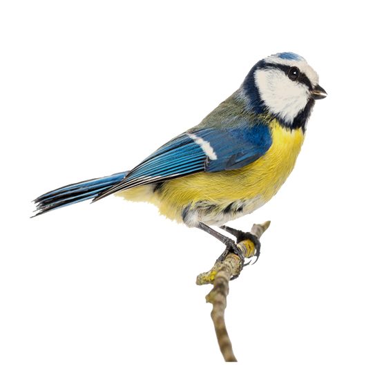
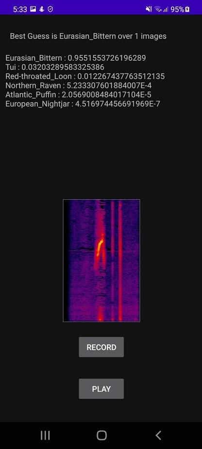

# Final Year Project App

## Investigating Methods of Birdsong Recognition on Mobile Devices

### Intro
* This repository contains the Android application that accompanies the report found [here](https://github.com/BurkeO/Dissertation).
* For the preprocessing and machine learning code, you will find it [here](https://github.com/BurkeO/Final_Year_Project).

The video below will illustrate the behaviour of the application with sample audio
